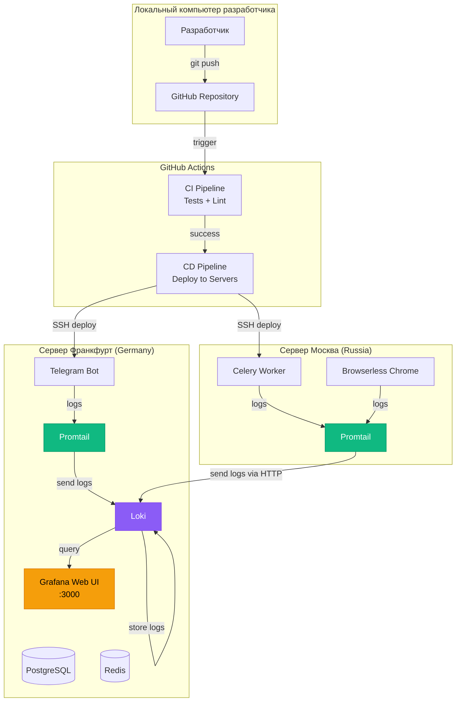
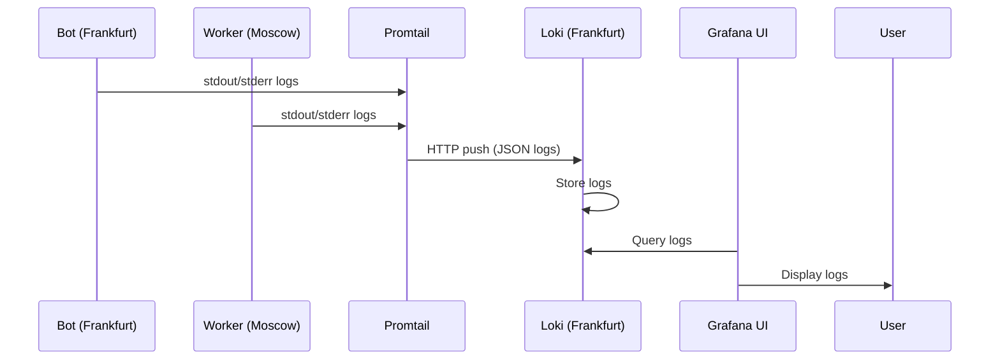

# План внедрения централизованного логирования и CI/CD

## Дата создания: 2026-06-10

## Архитектура решения



## Схема потока логов



---

## Этап 1: Подготовка кода для структурированного логирования

### 1.1 Обновление src/utils/logger.py

Текущий логгер пишет в файл и консоль. Нужно:

- Добавить JSON форматирование для легкого парсинга Promtail
- Добавить поля: `service_name`, `server_location`, `timestamp`, `level`, `message`
- Настроить вывод в stdout (Docker logging driver)

```python
# Новый формат логов (JSON)
{
  "timestamp": "2026-06-10T19:20:00Z",
  "level": "INFO",
  "service": "telegram-bot",
  "server": "frankfurt",
  "message": "Bot started",
  "trace_id": "optional"
}
```

### 1.2 Обновление Docker Compose файлов

Настроить Docker logging driver для отправки логов в локальный Promtail.

---

## Этап 2: Настройка централизованного логирования (Loki + Promtail + Grafana)

### 2.1 Размещение компонентов

| Компонент | Сервер    | Причина                                |
| --------- | --------- | -------------------------------------- |
| Loki      | Франкфурт | Основной сервер, стабильное соединение |
| Grafana   | Франкфурт | Web UI, доступ для разработчика        |
| Promtail  | Франкфурт | Сбор логов локальных контейнеров       |
| Promtail  | Москва    | Сбор логов удаленных контейнеров       |

### 2.2 Создаваемые файлы

```
telegram-bot/
├── observability/
│   ├── loki/
│   │   ├── loki-config.yaml
│   │   └── Dockerfile
│   ├── promtail/
│   │   ├── promtail-frankfurt.yaml
│   │   └── promtail-moscow.yaml
│   ├── grafana/
│   │   ├── dashboards/
│   │   │   ├── bot-logs.json
│   │   │   └── worker-logs.json
│   │   └── datasources/
│   │       └── loki.yaml
│   └── docker-compose.observability.yml
├── .github/
│   └── workflows/
│       ├── ci.yml
│       └── cd.yml
└── scripts/
    ├── deploy-frankfurt.sh
    └── deploy-moscow.sh
```

### 2.3 Конфигурация Loki (loki-config.yaml)

```yaml
auth_enabled: false

server:
  http_listen_port: 3100
  grpc_listen_port: 9096

common:
  instance_addr: 127.0.0.1
  path_prefix: /loki
  storage:
    filesystem:
      chunks_directory: /loki/chunks
      rules_directory: /loki/rules
  replication_factor: 1
  ring:
    kvstore:
      store: inmemory

schema_config:
  configs:
    - from: 2020-10-24
      store: boltdb-shipper
      object_store: filesystem
      schema: v11
      index:
        prefix: index_
        period: 24h

ruler:
  alertmanager_url: http://localhost:9093
```

### 2.4 Конфигурация Promtail для Франкфурта

```yaml
server:
  http_listen_port: 9080
  grpc_listen_port: 0

positions:
  filename: /tmp/positions.yaml

clients:
  - url: http://loki:3100/loki/api/v1/push

scrape_configs:
  - job_name: docker_containers
    docker_sd_configs:
      - host: unix:///var/run/docker.sock
    relabel_configs:
      - source_labels: [__meta_docker_container_name]
        regex: "/(.*)"
        target_label: container
      - source_labels: [__meta_docker_container_name]
        regex: "/(telegram_bot_app|cinema-postgres|telegram_bot_redis)"
        target_label: service
```

### 2.5 Конфигурация Promtail для Москвы (отправка на Франкфурт)

```yaml
clients:
  - url: http://FRANKFURT_SERVER_IP:3100/loki/api/v1/push
```

---

## Этап 3: Настройка CI/CD с GitHub Actions

### 3.1 CI Pipeline (.github/workflows/ci.yml)

```yaml
name: CI

on:
  push:
    branches: [main, develop]
  pull_request:
    branches: [main]

jobs:
  test:
    runs-on: ubuntu-latest
    steps:
      - uses: actions/checkout@v3
      - uses: actions/setup-python@v4
        with:
          python-version: "3.11"

      - name: Install dependencies
        run: pip install -r requirements.txt

      - name: Lint with ruff
        run: make lint

      - name: Format check
        run: make format

      - name: Run tests
        run: make test
```

### 3.2 CD Pipeline (.github/workflows/cd.yml)

```yaml
name: CD

on:
  push:
    branches: [main]

jobs:
  deploy-frankfurt:
    runs-on: ubuntu-latest
    steps:
      - name: Deploy to Frankfurt
        uses: appleboy/ssh-action@v1.0.0
        with:
          host: ${{ secrets.FRANKFURT_HOST }}
          username: ${{ secrets.FRANKFURT_USER }}
          key: ${{ secrets.FRANKFURT_SSH_KEY }}
          script: |
            cd /path/to/telegram-bot
            git pull origin main
            docker compose -f docker-compose.frankfurt.yml up -d --build
            docker compose -f docker-compose.observability.yml up -d

  deploy-moscow:
    runs-on: ubuntu-latest
    steps:
      - name: Deploy to Moscow
        uses: appleboy/ssh-action@v1.0.0
        with:
          host: ${{ secrets.MOSCOW_HOST }}
          username: ${{ secrets.MOSCOW_USER }}
          key: ${{ secrets.MOSCOW_SSH_KEY }}
          script: |
            cd /path/to/telegram-bot
            git pull origin main
            docker compose -f docker-compose.moscow.yml up -d --build
```

### 3.3 Настройка GitHub Secrets

Нужно добавить в GitHub Repository Settings > Secrets and variables > Actions:

| Secret              | Описание                                      |
| ------------------- | --------------------------------------------- |
| `FRANKFURT_HOST`    | IP адрес сервера во Франкфурте                |
| `FRANKFURT_USER`    | SSH пользователь (обычно `root` или `ubuntu`) |
| `FRANKFURT_SSH_KEY` | Приватный SSH ключ                            |
| `MOSCOW_HOST`       | IP адрес сервера в Москве                     |
| `MOSCOW_USER`       | SSH пользователь                              |
| `MOSCOW_SSH_KEY`    | Приватный SSH ключ                            |

---

## Этап 4: Обновление Docker Compose файлов

### 4.1 docker-compose.frankfurt.yml (добавить логирование)

```yaml
services:
  bot:
    # ... существующий конфиг ...
    logging:
      driver: "json-file"
      options:
        max-size: "10m"
        max-file: "3"
    labels:
      logging: "promtail"
      service: "telegram-bot"
```

### 4.2 docker-compose.observability.yml (новый файл для Франкфурта)

```yaml
services:
  loki:
    image: grafana/loki:2.9.2
    ports:
      - "3100:3100"
    command: -config.file=/etc/loki/loki-config.yaml
    volumes:
      - ./observability/loki/loki-config.yaml:/etc/loki/loki-config.yaml
      - loki_data:/loki
    networks:
      - observability_network

  promtail-frankfurt:
    image: grafana/promtail:2.9.2
    volumes:
      - /var/lib/docker/containers:/var/lib/docker/containers
      - /var/run/docker.sock:/var/run/docker.sock
      - ./observability/promtail/promtail-frankfurt.yaml:/etc/promtail/promtail-config.yaml
    command: -config.file=/etc/promtail/promtail-config.yaml
    networks:
      - observability_network

  grafana:
    image: grafana/grafana:10.2.3
    ports:
      - "3000:3000"
    environment:
      - GF_AUTH_ANONYMOUS_ENABLED=true
      - GF_AUTH_ANONYMOUS_ORG_ROLE=Viewer
    volumes:
      - grafana_data:/var/lib/grafana
      - ./observability/grafana/datasources:/etc/grafana/provisioning/datasources
      - ./observability/grafana/dashboards:/etc/grafana/provisioning/dashboards
    networks:
      - observability_network

networks:
  observability_network:
    driver: bridge

volumes:
  loki_data:
  grafana_data:
```

---

## Этап 5: Настройка дашбордов Grafana

### 5.1 Полезные запросы Loki (LogQL)

```logql
# Все логи бота
{service="telegram-bot"}

# Ошибки воркера в Москве
{service="celery-worker"} |= "ERROR"

# Логи за последний час
{service="telegram-bot"} |= `` | line_format "{{.timestamp}} {{.message}}"

# Фильтр по уровню логирования
{service=~"telegram-bot|celery-worker"} | json | level="ERROR"
```

---

## План реализации (по шагам)

| Шаг | Описание                                 | Файлы                                            |
| --- | ---------------------------------------- | ------------------------------------------------ |
| 1   | Обновить логгер для JSON формата         | `src/utils/logger.py`                            |
| 2   | Создать конфиг Loki                      | `observability/loki/loki-config.yaml`            |
| 3   | Создать конфиг Promtail (Франкфурт)      | `observability/promtail/promtail-frankfurt.yaml` |
| 4   | Создать конфиг Promtail (Москва)         | `observability/promtail/promtail-moscow.yaml`    |
| 5   | Создать docker-compose.observability.yml | `docker-compose.observability.yml`               |
| 6   | Настроить дашборды Grafana               | `observability/grafana/dashboards/*.json`        |
| 7   | Создать CI workflow                      | `.github/workflows/ci.yml`                       |
| 8   | Создать CD workflow                      | `.github/workflows/cd.yml`                       |
| 9   | Обновить .env.example файлы              | `.env.*.example`                                 |
| 10  | Создать документацию                     | `docs/LOGGING.md`, `docs/DEPLOYMENT_NEW.md`      |

---

## Безопасность

1. **Loki доступ**: Открыть порт 3100 только для сервера в Москве (firewall)
2. **Grafana доступ**: Настроить аутентификацию (не оставлять anonymous)
3. **SSH ключи**: Использовать deploy keys с ограниченными правами
4. **Secrets в GitHub**: Никогда не коммитить ключи в репозиторий

---

## Проверка работоспособности

После настройки проверить:

1. Логи появляются в Grafana (http://frankfurt-ip:3000)
2. CI запускается при push в main
3. CD успешно деплоит на оба сервера
4. Promtail в Москве может отправлять логи на Loki во Франкфурте
